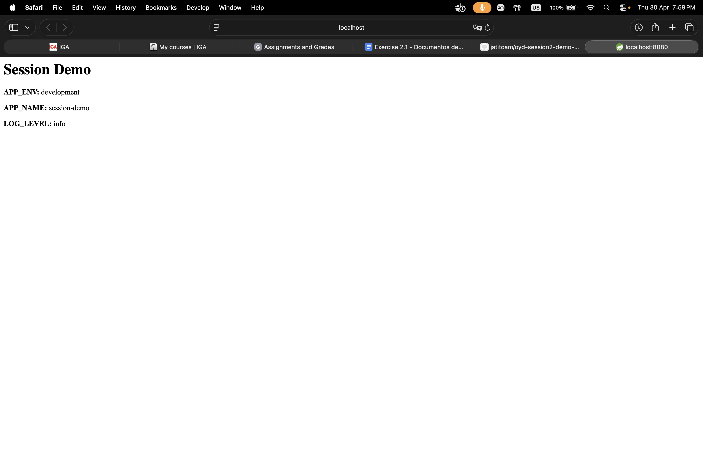

# oyd-exercise-2-1

Manifiestos de Kubernetes para una pequeña aplicación web en Node.js que lee tres variables de entorno (`APP_ENV`, `APP_NAME`, `LOG_LEVEL`) desde un ConfigMap y las muestra en el navegador.

## Evidence



## Validate and apply

```bash
kubectl apply -f k8s/ --dry-run=client
kubectl apply -f k8s/
kubectl get pods -n webapp
```
